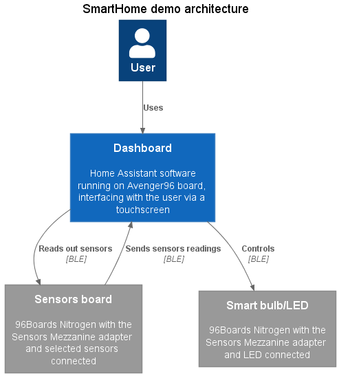

.. SPDX-FileCopyrightText: Huawei Inc.
..
.. SPDX-License-Identifier: CC-BY-4.0

Smart Panel Blueprint
#####################

.. contents::
   :depth: 3

Overview
********

The Smart Panel Blueprint provides support for building a PoC for a home
automation system with components showing the capabilities of the build
infrastructure in leveraging different kernels for building an end to end
solution.

The setup is composed of an Avenger96 board acting as a gateway and running
HomeAssistant. The gateway also provides UI as a browser connected to the
localhost HomeAssistant server. The gateway is connected over Bluetooth to two
Nitrogen boards exposing sensors and/or emulating device (e.g. light bulbs).

.. uml::

    title
      <b>High level connection diagram
    end title

    node "Avenger96" #11AAFF {
      [Linux]
    }

    node "Nitrogen #1" #116699 {
      [Zephyr#1]
    }

    node "Nitrogen #2" #116699 {
      [Zephyr#2]
    }

    [LED] #3BB300
    [LCD] #3BB300
    [MotionSensor] #3BB300
    [HumidityTemperature] #3BB300
    [Display]

    [Linux] --> [Display] : HDMI

    [Zephyr#1] --> Linux : BLE
    [Zephyr#1] --> LCD : I2C
    [Zephyr#1] <-- MotionSensor : I2C
    [Zephyr#1] <-- HumidityTemperature : GPIO

    [Zephyr#2] <-- Linux : BLE
    [Zephyr#2] --> LED : GPIO

    legend
    |= Legend: |
    |<back:#11AAFF>Avenger96:96Boards</back>|
    |<back:#116699>Nitrogen:96Boards</back>|
    |<back:#3BB300>Grove sensors</back>|
    endlegend

    [Human] --> [Display]

How to build
************

The Linux Gateway
-----------------

1. Refer to :ref:`Building OHOS image for Avenger96 <SupportedBoardAvenger96>` to learn how to set up a build environment, build and flash a base All Scenario OS Linux image.
2. Build blueprint image by invoking following bitbake command

.. code-block:: console

   $ MACHINE=stm32mp1-av96 DISTRO=allscenarios-linux-blueprint-dashboard bitbake blueprint-dashboard-gateway-image

IOT Endpoints
-------------
1. Connect Sensors Mezzanine adapter to each Nitrogen board. Connect I/O devices
   according to SmartHome Blueprint app `README <https://git.ostc-eu.org/OSTC/OHOS/components/smart_home_demo_zephyr/-/blob/develop/README.md#connections>`_
2. Refer to :ref:`Working with the board <SupportedBoardNitrogen>` to learn how to set up a build environment, build and flash a sample Zephyr application.
3. Connect target board to the PC using USB connector.
4. Build and flash blueprint image by invoking one of the following bitbake commands (for each IOT endpoint type respectively)

.. note:: In order to connect multiple and flash selected boards, please refer to
          `meta-zephyr README <http://git.yoctoproject.org/cgit/cgit.cgi/meta-zephyr/plain/README.txt>`_
          on how to use PYOCD_FLASH_IDS environment variable.

**For sensors board:**

* Connected I/O: LCD, DHT11, AK9753

.. code-block:: console

   $ MACHINE=96b-nitrogen DISTRO=allscenarios-zephyr bitbake zephyr-blueprint-smarthome-sensors -c flash_usb

**For bulb/LED board:**

* Connected I/O: LED

.. code-block:: console

   $ MACHINE=96b-nitrogen DISTRO=allscenarios-zephyr bitbake zephyr-blueprint-smarthome-led -c flash_usb

