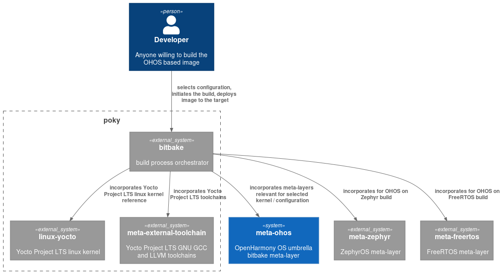

.. SPDX-FileCopyrightText: Huawei Inc.
..
.. SPDX-License-Identifier: CC-BY-4.0

.. include:: ../definitions.rst

|main_project_name| Build Architecture
######################################

Oniro build architecture is composed of multifaceted, independent, modular, and 
reusable building blocks, and in order to build OpenHarmony based images and 
its components, meta-openharmony serves as a primary building block. OpenHarmony 
OS depends on various building blocks, but in terms of applicability and other 
benefits, meta-openharmony essentially helps to desolate the barrier of 
hardware boundaries, inevitably transcending the classical OS dichotomy. 

In a closer view, `meta-openharmony` is a bitbake layer, containing recipes 
for building OpenHarmony images and components. The meta-openharmony includes
a number of different repo manifest files, which you can use to fetch all 
repositories needed for building OpenHarmony. To have a successful build image, 
ensure all the dependencies are met, and build the image. 
 
``Oniro Project`` architecture is documented using `c4 model <https://c4model.com/>`_.

.. contents:: 
    :depth: 2

Overview
********

|main_project_name| build infrastructure is designed to run atop variety of OS kernels
ranging from RTOSes to Linux.

``oniro`` is an *umbrella* of meta layers containing build's meta-data
required for compiling |main_project_name| images. The architecture supports plugging
various kernels.

